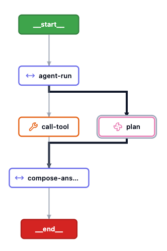
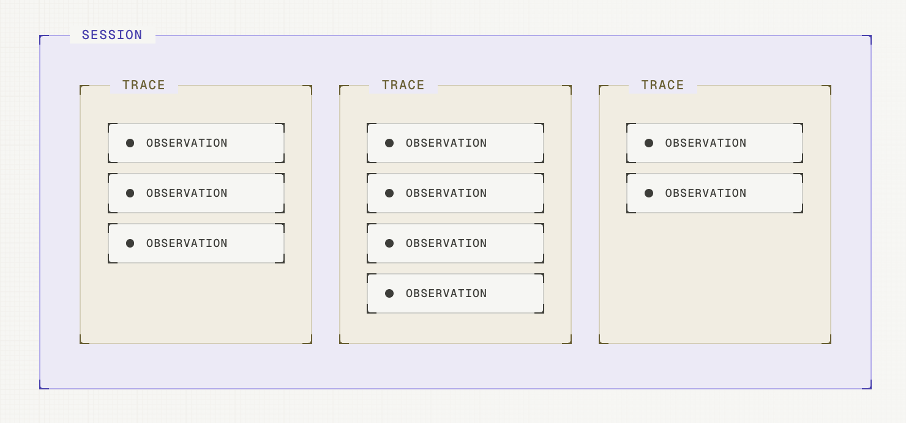
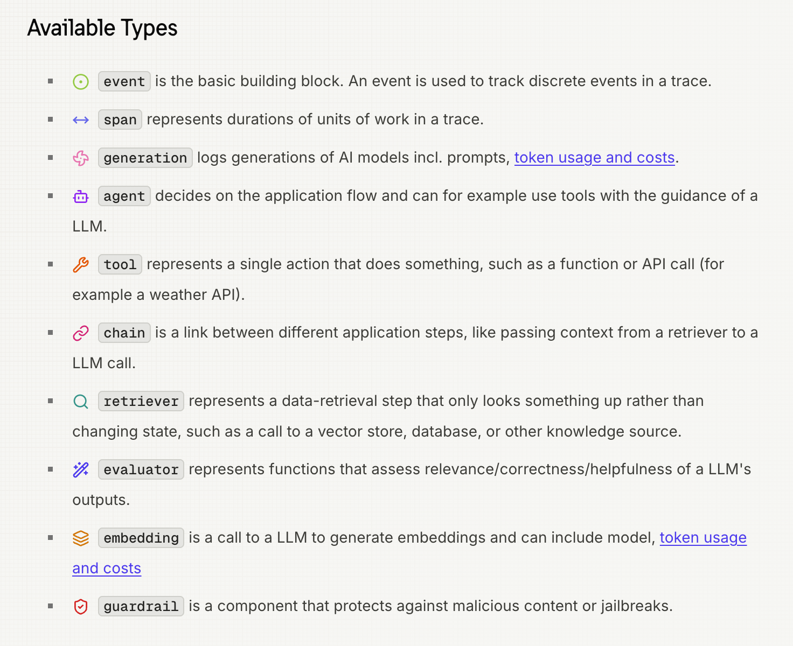

# Langfuse 연동 가이드

주의 - 해당 가이드는 GenOS에 built-in 되어 있는 langfuse에 대한 이야기가 아님. 코드 스페이스 등에서 개발한 에이전트를 Langfuse와 연동하는 방법에 대한 가이드. 사실상 Langfuse Documentation의 내용 중 필요한 내용만 가져와 사용하는 것과 다를 것이 없음.

## Langfuse란?

Agent 개발 시 에이전트의 플로우를 로깅, 모니터링, 평가 등등 할 수 있도록 해주는 도구임.

예를 들어 내가 간단한 바닐라 RAG Agent를 개발했다고 한다면, 분명 채팅 입력 -&gt; retrieve -&gt; prompt 생성 -&gt; LLM 답변 생성 -&gt; 출력 정도의 기본적인 flow가 있을건데,

langfuse를 사용하면 retrieve를 통해 어떤 문서들이 가져와졌고, 실제 LLM에 들어간 입력값은 어떻게 되고, 출력은 어떻게 되었으며, LLM이 에이전트라면 도구호출의 입력값과 출력값 등에 대한 것들도 모두 개별적으로 확인할 수 있다.

그에 더해 단순히 개발 상세 로그들만 확인할 수 있는 것이 아니라, 만들어진 에이전트를 그래프형태로 확인하고, 플로우 형태로 따라가면서 모니터링 및 로그 확인이 가능하다

[langfuse 예시(링크)](https://us.cloud.langfuse.com/project/cmu0rgd3m00g0ad0fcm8ahch3/traces/8126c48244c46e3e10cb131c4f0f4bb7?observation=955df6f6910eddb3)

*langfuse 에이전트 그래프*

langfuse의 주요 단어 및 로깅 방식에 대해 이해할 수 있어야 제대로된 로그 기록이 가능해진다.

`trace`:  워크플로우가 1회 실행하여 결과를 얻기까지의 경과(GenOS의 개념으로 보면 1턴)

`session`: Trace들의 모음. 에이전트가 멀티턴 등을 지원할때 해당 대화들을 저장한다고 생각하면 됨.

`observation`: 개별 동작 1회. 예: 리트리브, LLM 생성, 에이전트 동작 등. 개발에서는 함수 단위라고 보면 편할 듯. 동작 1회의 개념

*trace / session / observation 관계*

*observation 타입(span 종류)*

## 코드 기반 개발 시 Langfuse 연동

langfuse에 로그를 남기기 위해서는,

1. 사용하고 있는 Langfuse와 연결이 되어야 하고
2. 로그를 적재할 session을 정해야하며
3. 로깅할 데이터들을 정해야한다.

langfuse 연동을 위해서는 아래 3가지 환경 변수 설정이 필수다. `LANGFUSE_PUBLIC_KEY`와 `LANGFUSE_SECRET_KEY`는 langfuse에서 발급받아야 한다.

| 환경 변수 | 설명 |
| --- | --- |
| `LANGFUSE_HOST` | langfuse host url (self-host, cloud 등 사용 중인 langfuse의 BASE URL) |
| `LANGFUSE_PUBLIC_KEY` | langfuse에서 발급받는 public key |
| `LANGFUSE_SECRET_KEY` | langfuse에서 발급받는 secret key |

방식별 실제 연동 예제 코드는 [01_langfuse_예제.md](01_langfuse_예제.md)에서 확인할 수 있다.

&nbsp;