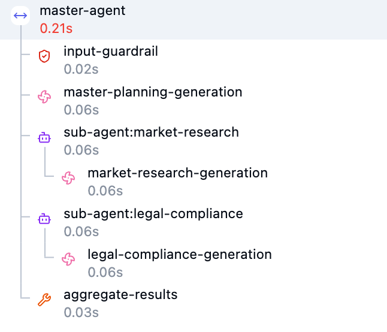
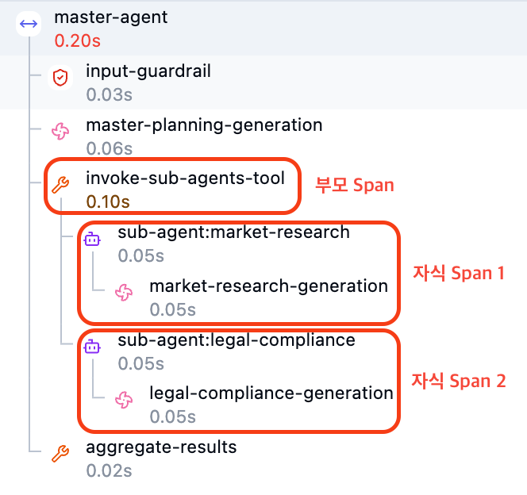

# Langfuse Propagation

Langfuse를 통해 여러 에이전트 오케스트레이션 전파하는 방법 설명.

*한 개발자가 에이전트를 개발한다고 해보자. 문제는 단일 에이전트가 아니라 여러 에이전트가 합쳐진 에이전트 오케스트레이션 형태로 만들 생각이다.*

*여기에 더해 해당 개발자는 추후 확장성을 고려해 각 서브에이전트를 코드 기반 호출이 아니라 통신 기반 호출을 사용하려고 한다.(호출 방식은...자유롭게. a2a나 api나 mcp나 등등...)*

*에이전트 모니터링을 Langfuse로 한다고 했을 때, 원하는 trace 결과는 아마 다음과 같은 형태일 것이다.*



*이런 형태로 만들기 위해서는 마스터 에이전트를 Langfuse에 기록할 때 사용한 Trace Context(Trace를 기록하기 위한 정보들)를 서브 에이전트에게 전파할 수 있어야 한다.*

*해당 장에서는 그 방법에 대해 이야기해보자.*

## Trace Propagation 필수 요소

Trace를 깨지지 않고 성공적으로 기록하기 위해서는 두가지 정보가 필수적으로 필요함.

- Trace-ID: 어떤 Trace에 기록할 것인가?
- Parent-Span-ID: 어떤 Span 하위로 들어갈 것인가?

기록될 Trace와 부모 Span이 정해지면, 해당 부모 Span 하위에서 본인 에이전트의 Span을 모두 기록하면 깔끔하게 기록됨.

*parent span & child span*



## 형식 검증 규칙

Langfuse에 전달하는 trace_id/parent_span_id는 정해진 형식을 만족해야 한다.

- **Trace ID**: 32자리의 16진수 문자열(32 hex chars). 예: `abcdef1234567890abcdef1234567890`
- **Observation ID(Parent Span ID)**: 16자리의 16진수 문자열(16 hex chars). 예: `fedcba0987654321`

## Trace Context 전달 방법

Trace Context를 실제 코드에 적용하는 방법은 크게 2가지임.

## Decorator

데코레이터는 해당 함수에 `langfuse_trace_id`, `langfuse_parent_observation_id`를 넣어주면 적용됨.

> [!IMPORTANT]
> 중요한 것은, 별도로 해당 인자들을 선언해줄 필요 없다는 것. 데코레이터가 인자를 알아서 처리한다.

```python
# Decorator의 경우
from langfuse.decorators import observe

# 데코레이터 적용
@observe()
def process_user_request(input_text):
    # 실제 함수 파라미터에는 langfuse_... 인자를 정의할 필요 없음.
    # 데코레이터가 가로채서 알아서 처리함.
    print(f"처리 중: {input_text}")
    return "완료"

# 외부(예: 프론트엔드, API Gateway 등)에서 전달받은 ID들
external_trace_id = "abcdef1234567890abcdef1234567890"
external_parent_span_id = "1234567890abcdef"

# 함수 호출 시 키워드 인자로 주입 (전파)
process_user_request(
    input_text="Hello",
    langfuse_trace_id=external_trace_id,                      # Trace ID 전파
    langfuse_parent_observation_id=external_parent_span_id    # Parent Span ID 전파
)
```

## Context Manager

Context Manager 방식을 적용할 땐 `trace_context`에 `trace_id`, `parent_span_id` 두 값을 넣어 전달하면 됨.

```python
from langfuse import get_client

langfuse = get_client()

# Use a predefined trace ID with trace_context parameter
with langfuse.start_as_current_observation(
    as_type="span",
    name="my-operation",
    trace_context={
        "trace_id": "abcdef1234567890abcdef1234567890",  # Must be 32 hex chars
        "parent_span_id": "fedcba0987654321"  # Optional, 16 hex chars
    }
) as observation:
    print(f"This observation has trace_id: {observation.trace_id}")
    # YOUR APPLICATION CODE HERE
```

## GenOS에서 Langfuse Context 전달 방법

1. 워크플로우
  1. GenOS Config를 통해 환경변수로 langfuse trace parent를 전달할 수 있는 헤더를 허용 설정 후 헤더에 `traceparent`를 넣어 전달
  2. body에 langfuse trace context를 넣어 전달
2. A2A - 불가능
  1. A2A에서는 GenOS가 헤더를 자체적으로 재구성할 수 없음. body도 변환할 수 없음.

워크플로우 경로(코드서빙 게이트웨이 경유 호출 포함)가 가능한 이유는 게이트웨이가 요청 body를 건드리지 않고 그대로 통과시키기 때문임.

코드서빙 요청 스키마는 사용자 정의이므로 게이트웨이가 body를 건드리지 않는다는 원칙을 따름.

body를 손대지 않으니 그 안에 실어 보낸 `trace_id`/`parent_span_id`가 상대 에이전트의 요청 스키마까지 그대로 도달함([`subagent_client.py`](codes/03_propagation/common/subagent_client.py) 참고).

반대로 A2A는 GenOS가 A2A 프로토콜 스펙에 맞춰 헤더/body를 직접 재구성하는 계층임. 그 과정에서 body에 넣은 임의 필드는 사라짐. 그래서 propagation이 불가능함.

## 예제 코드

- GenOS 워크플로우 API로 trace_id/parent_span_id를 이어받는 예: [`03_propagation`](codes/03_propagation)의 master 에이전트(`router.py`, `agents/master_agent/service.py`)
- A2A 경유 호출은 위에서 설명했듯 불가능하므로 대응하는 예제 코드 없음.

