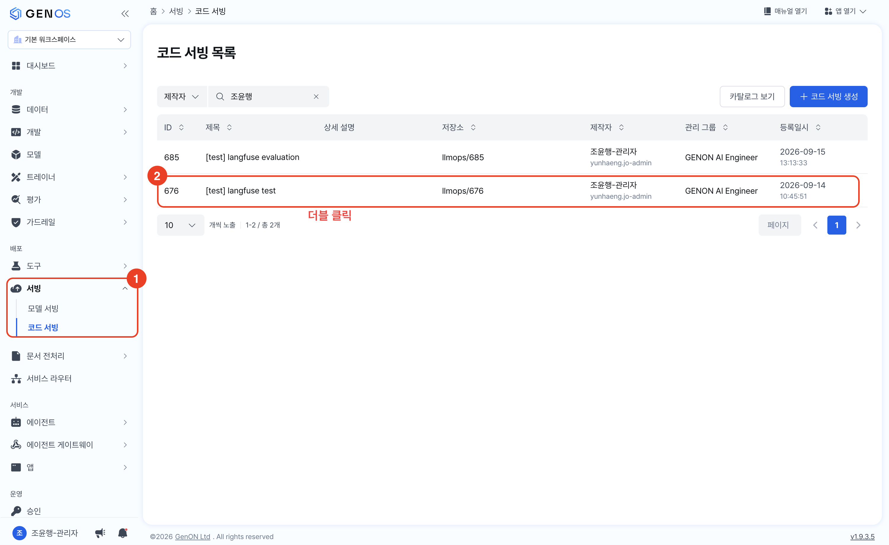
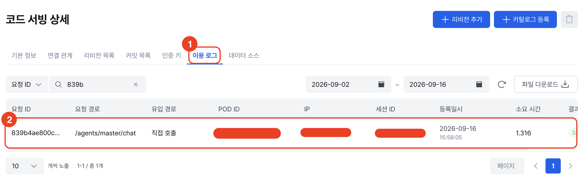
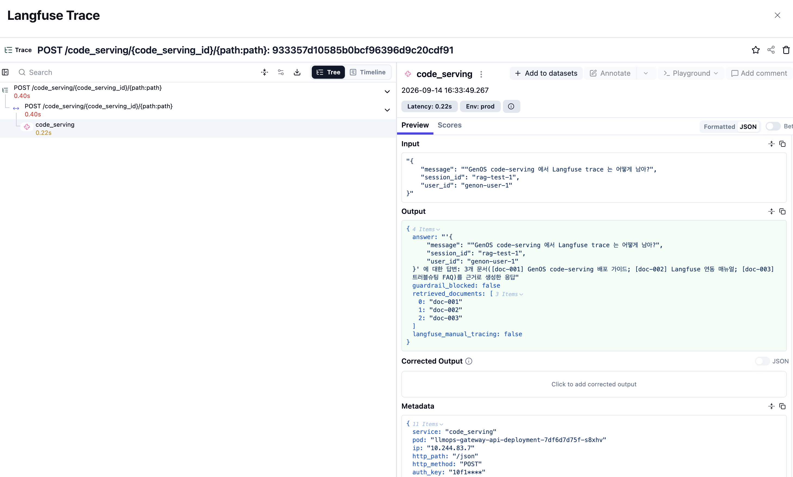

# Langfuse 매뉴얼

GenOS에서 "Langfuse"라고 하면 크게 두 가지를 가리킴.

- GenOS 자체가 내부적으로 사용하는 Langfuse. GenOS에서 서빙이 실행될 때마다 로깅. —&gt;  [GenOS Langfuse](#genos-langfuse)
-  Code Serving 등 개발 과정에서 사용자가 직접 외부 Langfuse를 연결해 로깅하는 것. —&gt; [외부 Langfuse 연동](#외부-langfuse-연동)

## GenOS Langfuse

GenOS는 서빙(모델&amp;코드)의 이용 로그를 `langfuse`로 보여줌.

이용 로그는 다음과 같이 볼 수 있음. 

1. `서빙` &gt; `코드 서빙(또는 모델 서빙)` 클릭 &gt;  보려는 서빙 더블클릭

2. `이용 로그` &gt; 목록 중 보려는 로그 클릭 

3. langfuse 형태의 로그 화면 확인

## 외부 Langfuse 연동

GenOS 상에서 개발 시 외부 langfuse 연동 방법에 대한 내용은 아래 내용들 확인.

- [00_langfuse_개요](00_langfuse_개요.md) — 내가 Langfuse가 무엇인지 전혀 모른다 -&gt; 읽자. Langfuse 개념
- [01_langfuse_예제](01_langfuse_예제.md) — RAG 파이프라인 계측 예제 코드
- [02_langfuse_평가](02_langfuse_평가.md) — Langfuse Score 기반 평가
- [03_langfuse_propagation](03_langfuse_propagation.md) — 멀티 에이전트 trace 전파
- [04_langfuse_session](04_langfuse_session.md) — Langfuse session과 GenOS 세션 연동

