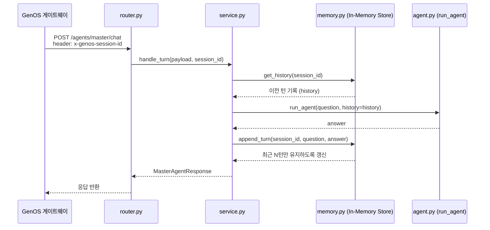

# Langfuse Propagation Example

03_langfuse_propagation.md의 예제 코드

**참고** 해당 예제에서는 02 예제 코드인 rag_agent를 Workflow 호출용 서브에이전트로 사용함.

즉, 총 두 개의 코드 서빙을 진행해야함

1. 서브 에이전트
  1. 02 예제 rag_agent. 해당 에이전트를 워크플로우로써 마스터 에이전트가 호출할 것이므로 GenOS 상에서 `코드 서빙 리비전 상세` &gt; `컨테이너 서비스` 메뉴에서 `워크플로우로 사용`을 통해 워크플로우 설정을 켜야함.(워크플로우 채팅 호출 경로 : /agents/rag/chat)
  2. 03 폴더에는 해당 에이전트 코드 없음. 02 코드 그대로 사용.
2. 마스터 에이전트
  1. 02 에이전트를 도구 형태로 호출. 도구가 본인의 `trace_id`와 `span_id`를 워크플로우 호출할 때 `trace_id`, `parent_span_id`를 넣을거임.

## GenOS 배포 절차

02(서브 에이전트) → 03(마스터 에이전트) 순서로 코드 서빙 2개를 등록해야 실제로 동작함. 아래는 GenOS `서빙` 메뉴를 처음 다루는 사람 기준으로 처음부터 끝까지 밟아야 하는 순서.

전체 흐름: `02 rag_agent 코드 서빙 등록` → `02를 워크플로우로 전환 + 토큰 발급` → `03 master_agent 코드 서빙 등록 + 환경변수 설정` → `GenOS에서 동작 확인`

## 1. 서브 에이전트(02 rag_agent) 코드 서빙 등록

1. 코드 스페이스 생성 &gt; 코드 서빙 생성하여 git url 생성 &gt; 코드 스페이스에 레포 복사 &gt; 해당 예제 코드 전체를 해당 serving id 하위로 복사
2. 변경 사항 git commit &amp; push
3. GenOS에서 코드 서빙 &gt; 해당 커밋 해시 기반 리비전 생성
4. 리비전 상세 페이지 &gt; 환경 변수 설정에서 .env.example의 값들을 모두 추가 &gt; 리비전 배포
5. 리비전 상세 페이지 &gt; 컨테이너 서비스 &gt; 워크플로우로 사용 &gt; 해당 에이전트 엔드포인트`/agents/rag/chat` 등록 후 저장

## 2. 02를 워크플로우로 전환 + 토큰 발급

02는 마스터 에이전트가 도구(워크플로우)로 호출할 것이므로, 배포만으로는 부족하고 아래 두 가지를 추가로 해줘야 함.

1. 방금 만든 코드 서빙의 `코드 서빙 리비전 상세` 화면으로 들어가 `컨테이너 서비스` 메뉴에서 `워크플로우로 사용` 옵션을 켬. (호출 경로 : `/agents/rag/chat` )
2. 같은(혹은 인접) 화면에서 이 코드 서빙 리소스 전용 Bearer 토큰을 발급.
3. 아래 값을 확인해서 메모해 둠. 03을 배포할 때 환경변수로 그대로 넣어야 함.

| 값                 | 확인 위치                     |
| ----------------- | ------------------------- |
| `code_serving_id` | 코드 서빙 상세 화면(주소창 또는 기본 정보) |
| `revision_id`     | 리비전 상세 화면                 |
| Bearer 토큰         | 위 2번에서 발급한 토큰             |

## 3. 마스터 에이전트(03 master_agent) 코드 서빙 등록

1. 다시 `서빙` &gt; `코드 서빙` &gt; 신규 등록으로 이동해서, 이번엔 `01_Langfuse/codes/03_propagation`을 배포 대상으로 하는 코드 서빙을 만듦.   
실행 진입점은 동일하게 `main.py`(`uvicorn main:app`)

2. 리비전 상세 화면의 환경변수 설정에서 아래 값을 채워 넣음. `RAG_SUBAGENT_*` 값은 2단계 3번에서 메모해 둔 02 정보를 그대로 사용.

| 환경변수                                                            | 설명                              | 비고                                   |
| --------------------------------------------------------------- | ------------------------------- | ------------------------------------ |
| `GENOS_URL`                                                     | 사용하는 GenOS 주소                   | 예: `https://genos.genon.ai`          |
| `GENOS_SERVING_ID`                                              | 마스터 에이전트 자신의 LLM 호출에 쓸 모델 서빙 id | GenOS 모델 서빙에서 확인                     |
| `GENOS_BEARER_TOKEN`                                            | 위 모델 서빙 인증키                     | 마스터 자신의 LLM 호출용(02 토큰과 다른 값)         |
| `GENOS_MODEL`                                                   | 호출할 모델명                         | 예: `z-ai/glm-5.2`                    |
| `RAG_SUBAGENT_CODE_SERVING_ID`                                  | 02(rag_agent) 코드 서빙 id          | 2단계 3번에서 확인한 `code_serving_id`       |
| `RAG_SUBAGENT_CODE_SERVING_REVISION_ID`                         | 02 코드 서빙 리비전 id                 | 2단계 3번에서 확인한 `revision_id`           |
| `RAG_SUBAGENT_BEARER_TOKEN`                                     | 02 코드서빙 리소스 전용 Bearer 토큰        | 2단계 2번에서 발급한 토큰                      |
| `RAG_SUBAGENT_PATH`                                             | 02 워크플로우 채팅 호출 경로               | 기본값 `/agents/rag/chat`. 안 바꿨으면 생략 가능 |
| `LANGFUSE_HOST` / `LANGFUSE_PUBLIC_KEY` / `LANGFUSE_SECRET_KEY` | 외부 Langfuse 연동 값(선택)            | 세 값 모두 넣어야 trace 계측이 켜짐              |

3. 환경변수 저장 후 배포/리비전 재빌드를 진행하고, 정상 상태가 될 때까지 대기.

## 4. 동작 확인

1. GenOS 채팅(마스터 에이전트를 연결해 둔 화면)에서 질문을 보내 정상 응답이 오는지 확인. 응답에 02 서브 에이전트가 반환한 `sourceDocuments` 등이 녹아 있으면 도구 호출까지 정상 동작한 것.

2. 연결한 langfuse에서 trace 확인. 해당 Langfuse 프로젝트에서 마스터 에이전트 span과 02 서브 에이전트 span이 하나의 trace 트리로 묶여 보이는지 확인.

### 세션 메모리 조회 플로우

master 에이전트가 `x-genos-session-id` 헤더를 받아 이전 대화 기록을 조회하고, 이번 턴이 끝나면 다시 저장하는 흐름은 다음과 같다.

