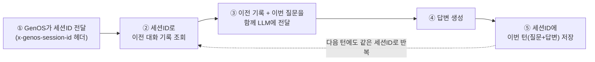

# GenOS 세션 관리

## 멀티턴이란?

채팅을 통해 AI와 대화할 때, 한번의 메세지를 주고, 응답을 받는 것을 GenOS에서는 "턴"의 개념으로 본다. 한 번 채팅해서 AI가 답변하면 1턴.

하지만 채팅에서는 한 턴으로 대화가 끝나지 않는 경우가 대부분.

하나의 채팅을 세션이라 하고, 해당 세션에서 여러번 대화를 주고받는 형태를 멀티턴이라 한다.

멀티턴이 되려면 마지막 턴 입력에 그 직전 턴까지의 대화 내용이 전달되어야한다.

## ⭐ GenOS에서 멀티턴 구현하는 법

**GenOS에서는 멀티턴을 따로 지원하지 않는다.**

단, GenOS는 워크플로우를 호출 할 때 `x-genos-session-id` 를 헤더로 전달해준다.

핵심은 이거 하나다 — **매 턴마다 `x-genos-session-id`를 key로 써서 "이전 기록 조회 → 이번 답변 생성 → 다시 저장"을 반복하는 것.**

즉, GenOS는 세션 ID"만" 챙겨줄 뿐이고, ②(조회) · ③(전달) · ⑤(저장)는 우리가 코드로 직접 채워야 한다. 

## 예제 코드

03 langfuse 전파 예제 코드의 master 에이전트에 In-Memory 방식의 멀티턴 기능이 구현되어져 있다.

[`03_propagation`](codes/03_propagation/README.md)